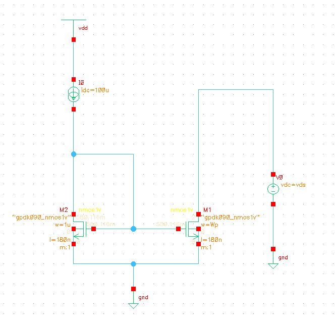
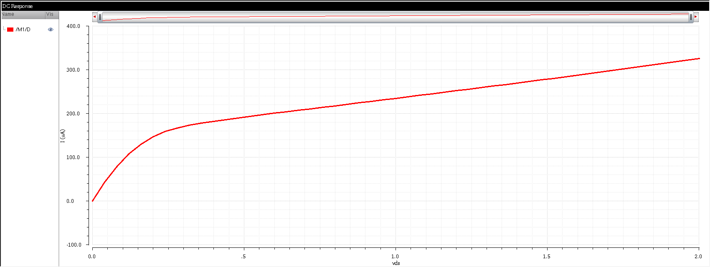
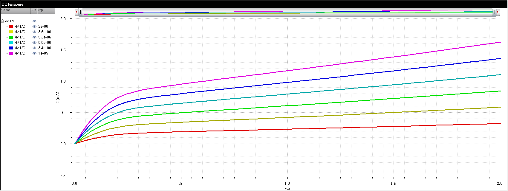

# Current Mirror Design

Full-custom CMOS current mirror design and analysis using Cadence Virtuoso.

---

## 🔧 Design Overview

**Circuit:** Basic CMOS current mirror  
**Technology:** GPDK045 / Similar CMOS process  
**Analysis:** DC sweep and parametric width variation

---

## 📐 Schematic

**Configuration:**
- Reference transistor (M1) with diode connection
- Mirror transistor (M2) replicates reference current
- PMOS-based current mirror topology

---

## 📊 DC Analysis

**Key Characteristics:**
- **Data Points:** 51 measurement points
- Characterizes current mirror DC transfer behavior
- Shows I-V relationship across operating range

**Analysis Details:**
- Sweep range captures linear and saturation regions
- Validates current mirroring accuracy
- Identifies output resistance characteristics

---

## 📈 Parametric Analysis

**Parameter Swept:** PMOS width (Wp)

**Configurations Tested:**
| Config | Wp (µm) | Purpose |
|--------|---------|---------|
| 1 | 2.0 | Minimum size, low power |
| 2 | 3.6 | Small area design |
| 3 | 5.2 | Balanced performance |
| 4 | 6.8 | Medium current |
| 5 | 8.4 | High current capability |
| 6 | 10.0 | Maximum drive strength |

---

## 🔬 Key Insights

### 1. Width Scaling Impact
- Wp varies from **2µm to 10µm** (5× range)
- Demonstrates current mirror performance across device sizes
- Tests current transfer ratio vs transistor geometry

### 2. Design Trade-offs

**Small Width (2-3.6µm):**
- ✅ Minimal silicon area
- ✅ Lower power consumption
- ⚠️ Reduced current capability
- ⚠️ Higher mismatch sensitivity

**Medium Width (5.2-6.8µm):**
- ✅ Balanced area vs performance
- ✅ Good current matching
- ✅ Moderate output resistance
- ✅ **Recommended for general use**

**Large Width (8.4-10µm):**
- ✅ Maximum current drive
- ✅ Best transistor matching
- ✅ Lower threshold variation
- ⚠️ Increased area and parasitic capacitance

### 3. Performance Characteristics
- **Current Scaling:** Approximately linear with width
- **Matching Accuracy:** Improves with larger devices
- **Output Resistance:** Inversely related to width
- **Speed:** Larger widths increase parasitic capacitance

---

## 🎯 Design Guidelines

### Current Requirements
- **Low current (< 10µA):** Use Wp = 2-3.6µm
- **Medium current (10-100µA):** Use Wp = 5.2-6.8µm
- **High current (> 100µA):** Use Wp = 8.4-10µm

### Application-Specific Selection
- **Biasing circuits:** Medium width for stability
- **Current references:** Larger width for better matching
- **Power-constrained designs:** Minimum width acceptable
- **High-speed applications:** Consider parasitic effects

---

## 🛠️ Tools Used

- **Cadence Virtuoso** - Schematic capture & simulation
- **Spectre** - SPICE-level circuit simulator
- **Parametric Analysis** - Automated design space exploration

---

## 📖 Simulation Data

**Available Data Files:**
- `dc_analysis_points.csv` - DC sweep measurements (51 points)
- `parametric__analysis.csv` - Width variation data (6 configs × 51 points)

**Data Format:**
- X-axis: Voltage sweep points
- Y-axis: Measured current values
- Columns: Organized by Wp parameter values

---

## 👤 Author

**Ram Tripathi**  
B.Sc. (H) Electronics  
Roll No: 22HEL2231

---

## 📝 Notes

- All measurements performed in Cadence Virtuoso environment
- CSV files contain raw simulation data for further analysis
- Parametric sweep enables systematic design optimization
- Results validated against theoretical current mirror equations

---

**Last Updated:** March 2026
